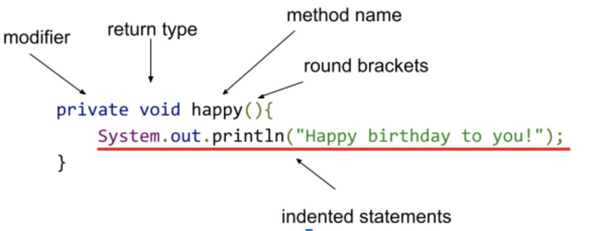

# 3.1 Introduction to Methods


### The methods to our madness so far

We've seen and worked with methods before:
* Math.sqrt(), Math.pow()
* random.nextInt()
* public void run()


## About Methods
You can think of a method as a **_subprogram_** - a small program inside of a program. 
* We write a sequence of statements and give that sequence a name. 
* The instructions can then be executed at any point in the program by referring to the method name.

The part of the program that creates a method is called a **_method definition._** When a method is subsequently used in a program, we say that the definition is **_called_** or **_invoked._** A single method definition may be called at many different points of a program.


## A Simple Example
Suppose you want to write a program that prints out the lyrics to the “Happy Birthday” song for a student named Fred. The standard lyrics look like this:

```
Happy birthday to you!
Happy birthday to you!
Happy birthday, dear Fred!
Happy birthday to you!
```

A simple program would consist of:

```java
System.out.println("Happy birthday to you!");
System.out.println("Happy birthday to you!");
System.out.println("Happy birthday, dear Fred!");
System.out.println("Happy birthday to you!");
```

Even though this is a short program, what are the practical issues with it?
* Program limited to Fred (not Bob or Justin)
* The "Happy birthday to you!" lines are repeated 

We can introduce a method to print the lyrics for the first, second, and fourth lines.
```java
private void happy() {
    System.out.println("Happy birthday to you!");
}
```


# A Program with Methods
```java
/**
* A program that greets happy birthday to Fred
*/

public class HappyBirthdayFred extends ConsoleProgram {
    public void run() {
       happy();
       happy();
       System.out.println("Happy birthday, dear Fred!");
       happy();
    }

    private void happy() {
       System.out.println("Happy birthday to you!");
    }
}
```


# Details of Defining a Simple Method
Methods are capable of doing a lot, however, let's keep it simple for now.  The general form of a method looks like like



| Part        | Description                                    |
| ------------| -----------------------------------------------|
| modifier    | Related to the visibility to other programs. For our purposes, we will set it to be `private` unless otherwise specified. Other options are `public` or not specifying a modifier at all (`default`) |
| return type | Indicates the data type of the value that the method will return. A method that returns nothing has a return type of `void` |
| method name | Just like with variables, we need to give a name to the method. **Follow the same naming rules and conventions as variables.** |

## Details of Calling a Method

Once we define a method, we can make use of it elsewhere in our program.  This is called **calling** or **invoking** a method.  Here's our standard run method again:


```java
    public void run() {
        happy();
        happy();
        System.out.println("Happy birthday, dear Fred!");
        happy();
    }
```

When the program runs, it executes the `run()` method.  The body of the `run()` method contains calls to the `happy()` method.  When this happens, the `happy()` body code is executed and the control goes back to the `run()` method.


# Why Use Methods?

* Saves time - you only need to code once
* Saves space - replace big calculations with one call to the function
* Reuse Code
* Easier error tracking/debugging - you can find and fix errors faster
* Maintainable Code - limit the number of changes to code when your program needs to be updated
* On a large project, different programmers can work on different methods